# $$\text{Digital Electronics}$$


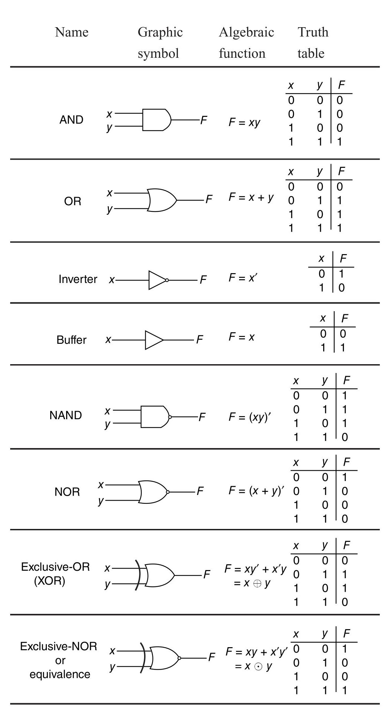

### $\text{Logic NOT}$


```python
def NOT(a):
    if a==1: return 0
    else : return 1
```

### $\text{Logic AND}$


```python
def AND(a,b):
    if (a==1)&(b==1): return 1
    else : return 0
```

### $\text{Logic OR}$


```python
def OR(a,b):
    if (a==1)|(b==1): return 1
    else : return 0
```

### $\text{Logic NAND}$


```python
def NAND(a,b):
    if (a==1)&(b==1): return 0
    else : return 1
```

### $\text{Logic NOR}$


```python
def NOR(a,b):
    if (a==1)|(b==1): return 0
    else : return 1
```

### $\text{Logic Exclusive-OR}$


```python
def XOR(a,b):
    if a==b: return 0
    else : return 1
```

### $\text{Logic Exclusive-NOR}$


```python
def XNOR(a,b):
    if a==b: return 1
    else : return 0
```

$\text{Inputs}$


```python
A=[0,0,1,1]
B=[0,1,0,1]

X1=[0,0,0,0,1,1,1,1]
Y1=[0,0,1,1,0,0,1,1]
Z1=[0,1,0,1,0,1,0,1]


P1=[0,0,0,0,0,0,0,0,1,1,1,1,1,1,1,1]
Q1=[0,0,0,0,1,1,1,1,0,0,0,0,1,1,1,1]
R1=[0,0,1,1,0,0,1,1,0,0,1,1,0,0,1,1]
S1=[0,1,0,1,0,1,0,1,0,1,0,1,0,1,0,1]
```

#### Checking the analytic function output of Logic


```python
print('Input','|\t','Output')
print(' 𝑎','𝑏',' |','𝑎̃ ','𝑏̃ ','𝑎⋅𝑏 ','𝑎+𝑏','𝑎↑𝑏 ','𝑎↓𝑏 ','𝑎⊕𝑏','𝑎⊙𝑏')
for a,b in zip(A,B):
    an=NOT(a)
    bn=NOT(b)
    A1=AND(a,b)
    O=OR(a,b)
    An=NAND(a,b)
    On=NOR(a,b)
    X=XOR(a,b)
    Xn=XNOR(a,b)
    print('',a,b,' |',an,'',bn,' ',A1,'  ',O,' ',An,'  ',On,'  ',X,'  ',Xn)
```

    Input |	 Output
     𝑎 𝑏  | 𝑎̃  𝑏̃  𝑎⋅𝑏  𝑎+𝑏 𝑎↑𝑏  𝑎↓𝑏  𝑎⊕𝑏 𝑎⊙𝑏
     0 0  | 1  1   0    0   1    1    0    1
     0 1  | 1  0   0    1   1    0    1    0
     1 0  | 0  1   0    1   1    0    1    0
     1 1  | 0  0   1    1   0    0    0    1
    

#### Checking the computed function with the analytic NAND Logic


```python
f=0
print('Input','|\t','Output')
print(' a','b ','|','  a⋅b',' a↑b_(cal)',' a↑b_(anl)')
for a,b in zip(A,B):
    print('',a,b,' |\t  ',AND(a,b),'\t',NOT(AND(a,b)),'\t ',NAND(a,b))
    if NOT(AND(a,b))==NAND(a,b):        f+=1
        
if f==len(A):
    print('\nLHS==RHS')
```

    Input |	 Output
     a b  |   a⋅b  a↑b_(cal)  a↑b_(anl)
     0 0  |	   0 	 1 	  1
     0 1  |	   0 	 1 	  1
     1 0  |	   0 	 1 	  1
     1 1  |	   1 	 0 	  0
    
    LHS==RHS
    

#### Checking the computed function with the analytic NOR Logic


```python
f=0
print('Input','|\t','Output')
print(' a',' b |','a+b','a↓b_(cal)','a↓b_(anl)')
for a,b in zip(A,B):
    print('',a,'',b,'| ',OR(a,b),'\t',NOT(OR(a,b)),'\t',NOR(a,b))
    if NOT(OR(a,b))==NOR(a,b):        f+=1
        
if f==len(A):
    print('\nLHS==RHS')
```

    Input |	 Output
     a  b | a+b a↓b_(cal) a↓b_(anl)
     0  0 |  0 	 1 	 1
     0  1 |  1 	 0 	 0
     1  0 |  1 	 0 	 0
     1  1 |  1 	 0 	 0
    
    LHS==RHS
    

**XOR**


**XNOR**


```python
f=0
print('Input','\t|\t','Output')
print('| a |','b |',' a⊕b_(cal) \t|',' a⊕b_(anl)\t|',' a⊙b_(cal)\t|',' a⊙b_(anl)\t|')
for a,b in zip(A,B):
    N1=NOT(a)
    N2=NOT(b)
    O1=OR(N1,N2)
    O2=OR(a,b)
    X=AND(O1,O2)
    A1=AND(a,b)
    A2=AND(N1,N2)
    Xn=OR(A1,A2)
    X_a=XOR(a,b)
    Xn_a=XNOR(a,b)
    print('|',a,'|',b,'|\t',X,'\t|\t',X_a,'\t|\t',Xn,'\t|\t',Xn_a,'\t|')
    if (X==X_a)&(Xn==Xn_a): f+=1
        
if f==len(A):
    print('\nLHS==RHS')
```

    Input 	|	 Output
    | a | b |  a⊕b_(cal) 	|  a⊕b_(anl)	|  a⊙b_(cal)	|  a⊙b_(anl)	|
    | 0 | 0 |	 0 	|	 0 	|	 1 	|	 1 	|
    | 0 | 1 |	 1 	|	 1 	|	 0 	|	 0 	|
    | 1 | 0 |	 1 	|	 1 	|	 0 	|	 0 	|
    | 1 | 1 |	 0 	|	 0 	|	 1 	|	 1 	|
    
    LHS==RHS
    

# **Conversion-  NAND IMPLEMENTATION**

**NOT** 


**AND** 


**OR** 


**NOR** 


**XOR** 


**XNOR** 


```python
print('Input','\t |\t','Output')
print('| a |',' b |','𝑎̃ |','𝑏̃ |',' a⋅b\t|','a+b\t|','a↓b\t|','a⊕b\t|','a⊙b\t|')

for a,b in zip(A,B):
    
    # NAND -> NOT
    gt1=NAND(a,a)
    
    # NAND -> AND
    gt2=NAND(a,b)
    gt3=NAND(gt2,gt2)
    
    # NAND -> OR
    gt4=NAND(b,b)
    gt5=NAND(gt1,gt4)
    
    # NAND -> NOR
    gt6=NAND(gt5,gt5)
    
    # NAND -> XOR
    gt7=NAND(a,gt2)
    gt8=NAND(b,gt2)
    gt9=NAND(gt7,gt8)
    
    # NAND -> XNOR
    gt10=NAND(gt9,gt9)
    
    print('|',a,'| ',b,'|',gt1,'|',gt4,'|  ',gt3,'\t| ',gt5,'\t| ',gt6,'\t| ',gt9,'\t| ',gt10,'\t|')
```

    Input 	 |	 Output
    | a |  b | 𝑎̃ | 𝑏̃ |  a⋅b	| a+b	| a↓b	| a⊕b	| a⊙b	|
    | 0 |  0 | 1 | 1 |   0 	|  0 	|  1 	|  0 	|  1 	|
    | 0 |  1 | 1 | 0 |   0 	|  1 	|  0 	|  1 	|  0 	|
    | 1 |  0 | 0 | 1 |   0 	|  1 	|  0 	|  1 	|  0 	|
    | 1 |  1 | 0 | 0 |   1 	|  1 	|  0 	|  0 	|  1 	|
    


```python
def NAND_NOT(a):
    return NAND(a,a)# NAND -> NOT
    
def NAND_AND(a,b):
    return NAND(NAND(a,b),NAND(a,b))# NAND -> AND
    
def NAND_OR(a,b):
    return NAND(NAND(a,a),NAND(b,b))# NAND -> OR

def NAND_NOR(a,b): 
    return NAND(NAND_OR(a,b),NAND_OR(a,b))# NAND -> NOR

def NAND_XOR(a,b):
    return NAND(NAND(a,NAND(a,b)),NAND(b,NAND(a,b)))# NAND -> XOR

def NAND_XNOR(a,b):
    return NAND(NAND_XOR(a,b),NAND_XOR(a,b))# NAND -> XNOR
```


```python
import pandas as pd

A1,A2,A3,A4,A5,A6,A7=[],[],[],[],[],[],[]
for a,b in zip(A,B):
    A1.append(NAND_NOT(a))
    A2.append(NAND_NOT(b))
    A3.append(NAND_AND(a,b))
    A4.append(NAND_OR(a,b))
    A5.append(NAND_NOR(a,b))
    A6.append(NAND_XOR(a,b))
    A7.append(NAND_XNOR(a,b))
pd.DataFrame({'a':a,'b':b,'𝑎̃':A1,'𝑏̃':A2,'a⋅b':A3,'a+b':A4,'a↓b':A5,'a⊕b':A6,'a⊙b':A7})
```


<div>
<style scoped>
    .dataframe tbody tr th:only-of-type {
        vertical-align: middle;
    }

    .dataframe tbody tr th {
        vertical-align: top;
    }

    .dataframe thead th {
        text-align: right;
    }
</style>
<table border="1" class="dataframe">
  <thead>
    <tr style="text-align: right;">
      <th></th>
      <th>a</th>
      <th>b</th>
      <th>𝑎̃</th>
      <th>𝑏̃</th>
      <th>a⋅b</th>
      <th>a+b</th>
      <th>a↓b</th>
      <th>a⊕b</th>
      <th>a⊙b</th>
    </tr>
  </thead>
  <tbody>
    <tr>
      <th>0</th>
      <td>1</td>
      <td>1</td>
      <td>1</td>
      <td>1</td>
      <td>0</td>
      <td>0</td>
      <td>1</td>
      <td>0</td>
      <td>1</td>
    </tr>
    <tr>
      <th>1</th>
      <td>1</td>
      <td>1</td>
      <td>1</td>
      <td>0</td>
      <td>0</td>
      <td>1</td>
      <td>0</td>
      <td>1</td>
      <td>0</td>
    </tr>
    <tr>
      <th>2</th>
      <td>1</td>
      <td>1</td>
      <td>0</td>
      <td>1</td>
      <td>0</td>
      <td>1</td>
      <td>0</td>
      <td>1</td>
      <td>0</td>
    </tr>
    <tr>
      <th>3</th>
      <td>1</td>
      <td>1</td>
      <td>0</td>
      <td>0</td>
      <td>1</td>
      <td>1</td>
      <td>0</td>
      <td>0</td>
      <td>1</td>
    </tr>
  </tbody>
</table>
</div>


# **Conversion-  NOR IMPLEMENTATION :**

**NOT** 


**OR**


**AND**


**NAND**


**XNOR**


**XOR**


```python
print('Input','\t | \t','Output')
print('| a |',' b |','𝑎̃ |','𝑏̃ |',' a+b\t|','a⋅b\t|','a↑b\t|','a⊕b\t|','a⊙b\t|')

for a,b in zip(A,B):
    
    # NOR -> NOT
    gt1=NOR(a,a)

    # NOR -> OR
    gt2=NOR(a,b)
    gt3=NOR(gt2,gt2)
    
    # NOR -> AND
    gt4=NOR(b,b)
    gt5=NOR(gt1,gt4)
    
    # NOR -> NAND
    gt6=NOR(gt5,gt5)
    
    # NOR -> XNOR
    gt7=NOR(a,gt2)
    gt8=NOR(b,gt2)
    gt9=NOR(gt7,gt8)
    
    # NOR -> XOR
    gt10=NOR(gt9,gt9)
    
    print('|',a,'| ',b,'|',gt1,'|',gt4,'|  ',gt3,' | ',gt5,'\t| ',gt6,'\t| ',gt9,'\t| ',gt10,'\t|')
```

    Input 	 | 	 Output
    | a |  b | 𝑎̃ | 𝑏̃ |  a+b	| a⋅b	| a↑b	| a⊕b	| a⊙b	|
    | 0 |  0 | 1 | 1 |   0  |  0 	|  1 	|  1 	|  0 	|
    | 0 |  1 | 1 | 0 |   1  |  0 	|  1 	|  0 	|  1 	|
    | 1 |  0 | 0 | 1 |   1  |  0 	|  1 	|  0 	|  1 	|
    | 1 |  1 | 0 | 0 |   1  |  1 	|  0 	|  1 	|  0 	|
    


```python
def NOR_NOT(a):
    return NOR(a,a)# NOR -> NOT
    
def NOR_AND(a,b):
    return NOR(NOR(a,a),NOR(b,b))# NOR -> AND
    
def NOR_OR(a,b):
    return NOR(NOR(a,b),NOR(a,b))# NOR -> OR

def NOR_NAND(a,b): 
    return NOR(NOR_AND(a,b),NOR_AND(a,b))# NOR -> NAND

def NOR_XNOR(a,b):
    return NOR(NOR(a,NOR(a,b)),NOR(b,NOR(a,b)))# NOR -> XNOR

def NOR_XOR(a,b):
    return NOR(NOR_XNOR(a,b),NOR_XNOR(a,b))# NOR -> XOR
```


```python
A1,A2,A3,A4,A5,A6,A7=[],[],[],[],[],[],[]
for a,b in zip(A,B):
    A1.append(NOR_NOT(a))
    A2.append(NOR_NOT(b))
    A3.append(NOR_OR(a,b))
    A4.append(NOR_AND(a,b))
    A5.append(NOR_NAND(a,b))
    A6.append(NOR_XOR(a,b))
    A7.append(NOR_XNOR(a,b))
pd.DataFrame({'a':a,'b':b,'𝑎̃':A1,'𝑏̃':A2,'a⋅b':A3,'a+b':A4,'a↑b':A5,'a⊕b':A6,'a⊙b':A7})
```


<div>
<style scoped>
    .dataframe tbody tr th:only-of-type {
        vertical-align: middle;
    }

    .dataframe tbody tr th {
        vertical-align: top;
    }

    .dataframe thead th {
        text-align: right;
    }
</style>
<table border="1" class="dataframe">
  <thead>
    <tr style="text-align: right;">
      <th></th>
      <th>a</th>
      <th>b</th>
      <th>𝑎̃</th>
      <th>𝑏̃</th>
      <th>a⋅b</th>
      <th>a+b</th>
      <th>a↑b</th>
      <th>a⊕b</th>
      <th>a⊙b</th>
    </tr>
  </thead>
  <tbody>
    <tr>
      <th>0</th>
      <td>1</td>
      <td>1</td>
      <td>1</td>
      <td>1</td>
      <td>0</td>
      <td>0</td>
      <td>1</td>
      <td>0</td>
      <td>1</td>
    </tr>
    <tr>
      <th>1</th>
      <td>1</td>
      <td>1</td>
      <td>1</td>
      <td>0</td>
      <td>1</td>
      <td>0</td>
      <td>1</td>
      <td>1</td>
      <td>0</td>
    </tr>
    <tr>
      <th>2</th>
      <td>1</td>
      <td>1</td>
      <td>0</td>
      <td>1</td>
      <td>1</td>
      <td>0</td>
      <td>1</td>
      <td>1</td>
      <td>0</td>
    </tr>
    <tr>
      <th>3</th>
      <td>1</td>
      <td>1</td>
      <td>0</td>
      <td>0</td>
      <td>1</td>
      <td>1</td>
      <td>0</td>
      <td>0</td>
      <td>1</td>
    </tr>
  </tbody>
</table>
</div>


# $\text{HALF ADDER}$


```python
def HalfAdder(a,b):
    s=XOR(a,b)
    c=AND(a,b)
    return s,c
```


```python
print('Input','|','Output')
print(' ','x','y','|','S','C')
for a,b in zip(A,B):
    s,c=HalfAdder(a,b)
    print(' ',a,b,'|',s,c)
```

    Input | Output
      x y | S C
      0 0 | 0 0
      0 1 | 1 0
      1 0 | 1 0
      1 1 | 0 1
    

# $\text{FULL ADDER}$
<p align="center">
  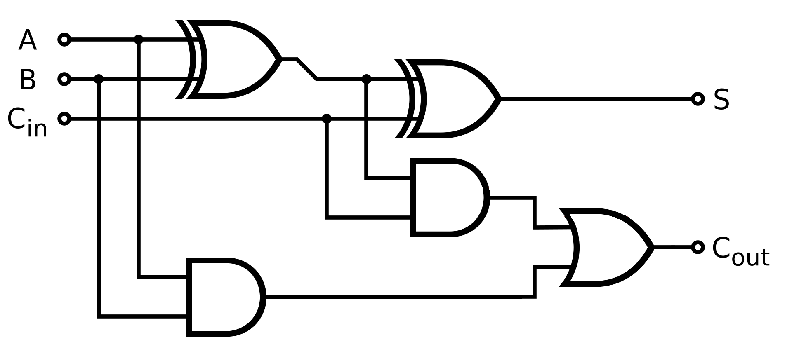
</p>


```python
def FullAdder(x,y,z):
    s1,c1=HalfAdder(x,y)
    s2,c2=HalfAdder(s1,z)
    return s2,OR(c1,c2)
```


```python
print('Input','|','Output')
print('x','y','z','|','S','C')
for x,y,z in zip(X1,Y1,Z1):
    sh,ch=FullAdder(x,y,z)
    print(x,y,z,'|',sh,ch)
```

    Input | Output
    x y z | S C
    0 0 0 | 0 0
    0 0 1 | 1 0
    0 1 0 | 1 0
    0 1 1 | 0 1
    1 0 0 | 1 0
    1 0 1 | 0 1
    1 1 0 | 0 1
    1 1 1 | 1 1
    

## **NAND logic of a full-adder**


```python
def NAND_FullAdder(x,y,z):
    S=NAND_XOR(NAND_XOR(x,y),z)
    C=NAND(NAND(NAND_XOR(x,y),z),NAND(x,y))
    return S,C
```


```python
print('Input','|','Output')
print('x','y','z','|','S','C')
for x,y,z in zip(X1,Y1,Z1):
    S,C=NAND_FullAdder(x,y,z)
    print(x,y,z,'|',S,C)
```

    Input | Output
    x y z | S C
    0 0 0 | 0 0
    0 0 1 | 1 0
    0 1 0 | 1 0
    0 1 1 | 0 1
    1 0 0 | 1 0
    1 0 1 | 0 1
    1 1 0 | 0 1
    1 1 1 | 1 1
    

## **NOR logic of a full-adder**


```python
def NOR_FullAdder(x,y,z):
    S=NOR_XNOR(NOR_XNOR(x,y),z)
    C=NOR(NOR(NOR_XNOR(x,y),z),NOR(x,y))
    return S,C
```


```python
print('Input','|','Output')
print('x','y','z','|','S','C')
for x,y,z in zip(X1,Y1,Z1):
    S,C=NOR_FullAdder(x,y,z) 
    print(x,y,z,'|',S,C)
```

    Input | Output
    x y z | S C
    0 0 0 | 0 0
    0 0 1 | 1 0
    0 1 0 | 1 0
    0 1 1 | 0 1
    1 0 0 | 1 0
    1 0 1 | 0 1
    1 1 0 | 0 1
    1 1 1 | 1 1
    

## Checking for logics $F_1,F_2$


```python
print('Input',' |','Output')
print(' x','y','z','| F\u2081','F\u2082')
for x,y,z in zip(X1,Y1,Z1):
    A1=AND(x,y)
    O1=OR(x,y)
    A2=AND(A1,z)
    O2=OR(O1,z)
    A3=AND(O1,z)
    O3=OR(A1,A3)  # F2
    N1=NOT(O3)
    A4=AND(N1,O3)
    O4=OR(A4,A2)  # F1
    print('',x,y,z,'|',O4,'',O3)
```

    Input  | Output
     x y z | F₁ F₂
     0 0 0 | 0  0
     0 0 1 | 0  0
     0 1 0 | 0  0
     0 1 1 | 0  1
     1 0 0 | 0  0
     1 0 1 | 0  1
     1 1 0 | 0  1
     1 1 1 | 1  1
    


```python

```


```python

```


```python

```

# $$\text{3-to-8-line decoder}$$


```python
def decoder3_8(x,y,z):
    # NOT
    N1=NOT(x)
    N2=NOT(y)
    N3=NOT(z)
    # AND
    A1=AND(N1,N2)
    A2=AND(A1,N3)   # x'y'z' ->D0
    A3=AND(A1,z)    # x'y'z  ->D1
    A4=AND(N1,y)
    A5=AND(A4,N3)   # x'yz'  ->D2
    A6=AND(A4,z)    # x'yz   ->D3
    A7=AND(x,N2)
    A8=AND(A7,N3)   # xy'z'  ->D4
    A9=AND(A7,z)    # xy'z   ->D5
    A10=AND(x,y)
    A11=AND(A10,N3) # xyz'   ->D6
    A12=AND(A10,z)  # xyz    ->D7
    return A2,A3,A5,A6,A8,A9,A11,A12
```


```python
print('Input','|\t','Output')
print('x','y','z','|','D\u2080','D\u2081','D\u2082','D\u2083','D\u2084','D\u2085','D\u2086','D\u2087')
for x,y,z in zip(X1,Y1,Z1):
    D0,D1,D2,D3,D4,D5,D6,D7=decoder3_8(x,y,z)
    print(x,y,z,'|',D0,'',D1,'',D2,'',D3,'',D4,'',D5,'',D6,'',D7)
```

    Input |	 Output
    x y z | D₀ D₁ D₂ D₃ D₄ D₅ D₆ D₇
    0 0 0 | 1  0  0  0  0  0  0  0
    0 0 1 | 0  1  0  0  0  0  0  0
    0 1 0 | 0  0  1  0  0  0  0  0
    0 1 1 | 0  0  0  1  0  0  0  0
    1 0 0 | 0  0  0  0  1  0  0  0
    1 0 1 | 0  0  0  0  0  1  0  0
    1 1 0 | 0  0  0  0  0  0  1  0
    1 1 1 | 0  0  0  0  0  0  0  1
    

# $$\text{3-to-8-line decoder with Enable}$$


```python
def decoder3_8E(x,y,z,E):
    # NOT
    N1=NOT(x)
    N2=NOT(y)
    N3=NOT(z)
    E1=NOT(E)
    # AND
    A1=AND(N1,N2)
    A2=AND(AND(A1,N3),E1)   # x'y'z'E' ->D0
    A3=AND(AND(A1,z),E1)    # x'y'zE'  ->D1
    A4=AND(N1,y)
    A5=AND(AND(A4,N3),E1)   # x'yz'E'  ->D2
    A6=AND(AND(A4,z),E1)    # x'yzE'   ->D3
    A7=AND(x,N2)
    A8=AND(AND(A7,N3),E1)   # xy'z'E'  ->D4
    A9=AND(AND(A7,z),E1)    # xy'zE'   ->D5
    A10=AND(x,y)
    A11=AND(AND(A10,N3),E1) # xyz'E'   ->D6
    A12=AND(AND(A10,z),E1)  # xyzE'    ->D7
    return A2,A3,A5,A6,A8,A9,A11,A12
```


```python
print('Input','  |\t','Output')
print('E','x','y','z','|','D\u2080','D\u2081','D\u2082','D\u2083','D\u2084','D\u2085','D\u2086','D\u2087')
for E in [0,1]:
    for x,y,z in zip(X1,Y1,Z1):
        D0,D1,D2,D3,D4,D5,D6,D7=decoder3_8E(x,y,z,E)
        print(E,x,y,z,'|',D0,'',D1,'',D2,'',D3,'',D4,'',D5,'',D6,'',D7)
```

    Input   |	 Output
    E x y z | D₀ D₁ D₂ D₃ D₄ D₅ D₆ D₇
    0 0 0 0 | 1  0  0  0  0  0  0  0
    0 0 0 1 | 0  1  0  0  0  0  0  0
    0 0 1 0 | 0  0  1  0  0  0  0  0
    0 0 1 1 | 0  0  0  1  0  0  0  0
    0 1 0 0 | 0  0  0  0  1  0  0  0
    0 1 0 1 | 0  0  0  0  0  1  0  0
    0 1 1 0 | 0  0  0  0  0  0  1  0
    0 1 1 1 | 0  0  0  0  0  0  0  1
    1 0 0 0 | 0  0  0  0  0  0  0  0
    1 0 0 1 | 0  0  0  0  0  0  0  0
    1 0 1 0 | 0  0  0  0  0  0  0  0
    1 0 1 1 | 0  0  0  0  0  0  0  0
    1 1 0 0 | 0  0  0  0  0  0  0  0
    1 1 0 1 | 0  0  0  0  0  0  0  0
    1 1 1 0 | 0  0  0  0  0  0  0  0
    1 1 1 1 | 0  0  0  0  0  0  0  0
    

# $$\text{4-to-16-line decoder using 2 x 3-to-8-line decoder}$$


```python
print('Input','  |\t','Output')
print('E','x','y','z','|','D₀','D₁','D₂','D₃','D₄','D₅','D₆','D₇','D₈','D₉','D₁₀','D₁₁','D₁₂','D₁₃','D₁₄','D₁₅')
for E in [0,1]:
    for x,y,z in zip(X1,Y1,Z1):
        D0,D1,D2,D3,D4,D5,D6,D7=decoder3_8E(x,y,z,E)
        D8,D9,D10,D11,D12,D13,D14,D15=decoder3_8E(x,y,z,NOT(E))
        print(E,x,y,z,'|',D0,'',D1,'',D2,'',D3,'',D4,'',D5,'',D6,'',\
              D7,'',D8,'',D9,' ',D10,' ',D11,' ',D12,' ',D13,' ',D14,' ',D15)
        

```

    Input   |	 Output
    E x y z | D₀ D₁ D₂ D₃ D₄ D₅ D₆ D₇ D₈ D₉ D₁₀ D₁₁ D₁₂ D₁₃ D₁₄ D₁₅
    0 0 0 0 | 1  0  0  0  0  0  0  0  0  0   0   0   0   0   0   0
    0 0 0 1 | 0  1  0  0  0  0  0  0  0  0   0   0   0   0   0   0
    0 0 1 0 | 0  0  1  0  0  0  0  0  0  0   0   0   0   0   0   0
    0 0 1 1 | 0  0  0  1  0  0  0  0  0  0   0   0   0   0   0   0
    0 1 0 0 | 0  0  0  0  1  0  0  0  0  0   0   0   0   0   0   0
    0 1 0 1 | 0  0  0  0  0  1  0  0  0  0   0   0   0   0   0   0
    0 1 1 0 | 0  0  0  0  0  0  1  0  0  0   0   0   0   0   0   0
    0 1 1 1 | 0  0  0  0  0  0  0  1  0  0   0   0   0   0   0   0
    1 0 0 0 | 0  0  0  0  0  0  0  0  1  0   0   0   0   0   0   0
    1 0 0 1 | 0  0  0  0  0  0  0  0  0  1   0   0   0   0   0   0
    1 0 1 0 | 0  0  0  0  0  0  0  0  0  0   1   0   0   0   0   0
    1 0 1 1 | 0  0  0  0  0  0  0  0  0  0   0   1   0   0   0   0
    1 1 0 0 | 0  0  0  0  0  0  0  0  0  0   0   0   1   0   0   0
    1 1 0 1 | 0  0  0  0  0  0  0  0  0  0   0   0   0   1   0   0
    1 1 1 0 | 0  0  0  0  0  0  0  0  0  0   0   0   0   0   1   0
    1 1 1 1 | 0  0  0  0  0  0  0  0  0  0   0   0   0   0   0   1
    


```python
El,xl,yl,zl=[],[],[],[]
d0,d1,d2,d3,d4,d5,d6,d7,d8,d9,d10,d11,d12,d13,d14,d15=[],[],[],[],[],[],[],[],[],[],[],[],[],[],[],[]
for E in [0,1]:
    for x,y,z in zip(X1,Y1,Z1):
        E1=E
        D0,D1,D2,D3,D4,D5,D6,D7=decoder3_8E(x,y,z,E)
        D8,D9,D10,D11,D12,D13,D14,D15=decoder3_8E(x,y,z,NOT(E))
        
        El.append(E1)
        xl.append(x)
        yl.append(y)
        zl.append(z)
        d0.append(D0)
        d1.append(D1)
        d2.append(D2)
        d3.append(D3)
        d4.append(D4)
        d5.append(D5)
        d6.append(D6)
        d7.append(D7)
        d8.append(D8)
        d9.append(D9)
        d10.append(D10)
        d11.append(D11)
        d12.append(D12)
        d13.append(D13)
        d14.append(D14)
        d15.append(D15)
        
pd.DataFrame({'E':El,'x':xl,'y':yl,'z':zl,
              'D₀':d0,'D₁':d1,'D₂':d2,'D₃':d3,'D₄':d4,'D₅':d5,'D₆':d6,'D₇':d7,
              'D₈':d8,'D₉':d9,'D₁₀':d10,'D₁₁':d11,'D₁₂':d12,'D₁₃':d13,'D₁₄':d14,'D₁₅':d15})
```


<div>
<style scoped>
    .dataframe tbody tr th:only-of-type {
        vertical-align: middle;
    }

    .dataframe tbody tr th {
        vertical-align: top;
    }

    .dataframe thead th {
        text-align: right;
    }
</style>
<table border="1" class="dataframe">
  <thead>
    <tr style="text-align: right;">
      <th></th>
      <th>E</th>
      <th>x</th>
      <th>y</th>
      <th>z</th>
      <th>D₀</th>
      <th>D₁</th>
      <th>D₂</th>
      <th>D₃</th>
      <th>D₄</th>
      <th>D₅</th>
      <th>D₆</th>
      <th>D₇</th>
      <th>D₈</th>
      <th>D₉</th>
      <th>D₁₀</th>
      <th>D₁₁</th>
      <th>D₁₂</th>
      <th>D₁₃</th>
      <th>D₁₄</th>
      <th>D₁₅</th>
    </tr>
  </thead>
  <tbody>
    <tr>
      <th>0</th>
      <td>0</td>
      <td>0</td>
      <td>0</td>
      <td>0</td>
      <td>1</td>
      <td>0</td>
      <td>0</td>
      <td>0</td>
      <td>0</td>
      <td>0</td>
      <td>0</td>
      <td>0</td>
      <td>0</td>
      <td>0</td>
      <td>0</td>
      <td>0</td>
      <td>0</td>
      <td>0</td>
      <td>0</td>
      <td>0</td>
    </tr>
    <tr>
      <th>1</th>
      <td>0</td>
      <td>0</td>
      <td>0</td>
      <td>1</td>
      <td>0</td>
      <td>1</td>
      <td>0</td>
      <td>0</td>
      <td>0</td>
      <td>0</td>
      <td>0</td>
      <td>0</td>
      <td>0</td>
      <td>0</td>
      <td>0</td>
      <td>0</td>
      <td>0</td>
      <td>0</td>
      <td>0</td>
      <td>0</td>
    </tr>
    <tr>
      <th>2</th>
      <td>0</td>
      <td>0</td>
      <td>1</td>
      <td>0</td>
      <td>0</td>
      <td>0</td>
      <td>1</td>
      <td>0</td>
      <td>0</td>
      <td>0</td>
      <td>0</td>
      <td>0</td>
      <td>0</td>
      <td>0</td>
      <td>0</td>
      <td>0</td>
      <td>0</td>
      <td>0</td>
      <td>0</td>
      <td>0</td>
    </tr>
    <tr>
      <th>3</th>
      <td>0</td>
      <td>0</td>
      <td>1</td>
      <td>1</td>
      <td>0</td>
      <td>0</td>
      <td>0</td>
      <td>1</td>
      <td>0</td>
      <td>0</td>
      <td>0</td>
      <td>0</td>
      <td>0</td>
      <td>0</td>
      <td>0</td>
      <td>0</td>
      <td>0</td>
      <td>0</td>
      <td>0</td>
      <td>0</td>
    </tr>
    <tr>
      <th>4</th>
      <td>0</td>
      <td>1</td>
      <td>0</td>
      <td>0</td>
      <td>0</td>
      <td>0</td>
      <td>0</td>
      <td>0</td>
      <td>1</td>
      <td>0</td>
      <td>0</td>
      <td>0</td>
      <td>0</td>
      <td>0</td>
      <td>0</td>
      <td>0</td>
      <td>0</td>
      <td>0</td>
      <td>0</td>
      <td>0</td>
    </tr>
    <tr>
      <th>5</th>
      <td>0</td>
      <td>1</td>
      <td>0</td>
      <td>1</td>
      <td>0</td>
      <td>0</td>
      <td>0</td>
      <td>0</td>
      <td>0</td>
      <td>1</td>
      <td>0</td>
      <td>0</td>
      <td>0</td>
      <td>0</td>
      <td>0</td>
      <td>0</td>
      <td>0</td>
      <td>0</td>
      <td>0</td>
      <td>0</td>
    </tr>
    <tr>
      <th>6</th>
      <td>0</td>
      <td>1</td>
      <td>1</td>
      <td>0</td>
      <td>0</td>
      <td>0</td>
      <td>0</td>
      <td>0</td>
      <td>0</td>
      <td>0</td>
      <td>1</td>
      <td>0</td>
      <td>0</td>
      <td>0</td>
      <td>0</td>
      <td>0</td>
      <td>0</td>
      <td>0</td>
      <td>0</td>
      <td>0</td>
    </tr>
    <tr>
      <th>7</th>
      <td>0</td>
      <td>1</td>
      <td>1</td>
      <td>1</td>
      <td>0</td>
      <td>0</td>
      <td>0</td>
      <td>0</td>
      <td>0</td>
      <td>0</td>
      <td>0</td>
      <td>1</td>
      <td>0</td>
      <td>0</td>
      <td>0</td>
      <td>0</td>
      <td>0</td>
      <td>0</td>
      <td>0</td>
      <td>0</td>
    </tr>
    <tr>
      <th>8</th>
      <td>1</td>
      <td>0</td>
      <td>0</td>
      <td>0</td>
      <td>0</td>
      <td>0</td>
      <td>0</td>
      <td>0</td>
      <td>0</td>
      <td>0</td>
      <td>0</td>
      <td>0</td>
      <td>1</td>
      <td>0</td>
      <td>0</td>
      <td>0</td>
      <td>0</td>
      <td>0</td>
      <td>0</td>
      <td>0</td>
    </tr>
    <tr>
      <th>9</th>
      <td>1</td>
      <td>0</td>
      <td>0</td>
      <td>1</td>
      <td>0</td>
      <td>0</td>
      <td>0</td>
      <td>0</td>
      <td>0</td>
      <td>0</td>
      <td>0</td>
      <td>0</td>
      <td>0</td>
      <td>1</td>
      <td>0</td>
      <td>0</td>
      <td>0</td>
      <td>0</td>
      <td>0</td>
      <td>0</td>
    </tr>
    <tr>
      <th>10</th>
      <td>1</td>
      <td>0</td>
      <td>1</td>
      <td>0</td>
      <td>0</td>
      <td>0</td>
      <td>0</td>
      <td>0</td>
      <td>0</td>
      <td>0</td>
      <td>0</td>
      <td>0</td>
      <td>0</td>
      <td>0</td>
      <td>1</td>
      <td>0</td>
      <td>0</td>
      <td>0</td>
      <td>0</td>
      <td>0</td>
    </tr>
    <tr>
      <th>11</th>
      <td>1</td>
      <td>0</td>
      <td>1</td>
      <td>1</td>
      <td>0</td>
      <td>0</td>
      <td>0</td>
      <td>0</td>
      <td>0</td>
      <td>0</td>
      <td>0</td>
      <td>0</td>
      <td>0</td>
      <td>0</td>
      <td>0</td>
      <td>1</td>
      <td>0</td>
      <td>0</td>
      <td>0</td>
      <td>0</td>
    </tr>
    <tr>
      <th>12</th>
      <td>1</td>
      <td>1</td>
      <td>0</td>
      <td>0</td>
      <td>0</td>
      <td>0</td>
      <td>0</td>
      <td>0</td>
      <td>0</td>
      <td>0</td>
      <td>0</td>
      <td>0</td>
      <td>0</td>
      <td>0</td>
      <td>0</td>
      <td>0</td>
      <td>1</td>
      <td>0</td>
      <td>0</td>
      <td>0</td>
    </tr>
    <tr>
      <th>13</th>
      <td>1</td>
      <td>1</td>
      <td>0</td>
      <td>1</td>
      <td>0</td>
      <td>0</td>
      <td>0</td>
      <td>0</td>
      <td>0</td>
      <td>0</td>
      <td>0</td>
      <td>0</td>
      <td>0</td>
      <td>0</td>
      <td>0</td>
      <td>0</td>
      <td>0</td>
      <td>1</td>
      <td>0</td>
      <td>0</td>
    </tr>
    <tr>
      <th>14</th>
      <td>1</td>
      <td>1</td>
      <td>1</td>
      <td>0</td>
      <td>0</td>
      <td>0</td>
      <td>0</td>
      <td>0</td>
      <td>0</td>
      <td>0</td>
      <td>0</td>
      <td>0</td>
      <td>0</td>
      <td>0</td>
      <td>0</td>
      <td>0</td>
      <td>0</td>
      <td>0</td>
      <td>1</td>
      <td>0</td>
    </tr>
    <tr>
      <th>15</th>
      <td>1</td>
      <td>1</td>
      <td>1</td>
      <td>1</td>
      <td>0</td>
      <td>0</td>
      <td>0</td>
      <td>0</td>
      <td>0</td>
      <td>0</td>
      <td>0</td>
      <td>0</td>
      <td>0</td>
      <td>0</td>
      <td>0</td>
      <td>0</td>
      <td>0</td>
      <td>0</td>
      <td>0</td>
      <td>1</td>
    </tr>
  </tbody>
</table>
</div>


# $$\text{BCD-to-decimal decoder}$$
  


```python
def BCD_Decimal_Decoder(w,x,y,z):    
    # NOT
    N1=NOT(w)
    N2=NOT(x)
    N3=NOT(y)
    N4=NOT(z)
    # AND
    A1=AND(N1,N2)   # w'x'
    A2=AND(A1,N3)   # w'x'y'
    A3=AND(A2,N4)   # w'x'y'z' ->D0
    A4=AND(A2,z)    # w'x'y'z  ->D1
    A5=AND(N2,y)    # x'y
    A6=AND(A5,N4)   # x'yz'    ->D2
    A7=AND(A5,z)    # x'yz     ->D3
    A8=AND(x,N3)    # xy'
    A9=AND(A8,N4)   # xy'z'    ->D4
    A10=AND(A8,z)   # xy'z     ->D5
    A11=AND(x,y)    # xy
    A12=AND(A11,N4) # xyz'     ->D6
    A13=AND(A11,z)  # xyz      ->D7
    A14=AND(w,N4)   # wz'      ->D8
    A15=AND(w,z)    # wz       ->D9
    return A3,A4,A6,A7,A9,A10,A12,A13,A14,A15
```


```python
print('Input','\t|\t','Output')
print('w','x','y','z','|','D₀','D₁','D₂','D₃','D₄','D₅','D₆','D₇','D₈','D₉')
for w,x,y,z in zip(P1,Q1,R1,S1):
    D0,D1,D2,D3,D4,D5,D6,D7,D8,D9=BCD_Decimal_Decoder(w,x,y,z)
    print(w,x,y,z,'|',D0,'',D1,'',D2,'',D3,'',D4,'',D5,'',D6,'',D7,'',D8,'',D9)
```

    Input 	|	 Output
    w x y z | D₀ D₁ D₂ D₃ D₄ D₅ D₆ D₇ D₈ D₉
    0 0 0 0 | 1  0  0  0  0  0  0  0  0  0
    0 0 0 1 | 0  1  0  0  0  0  0  0  0  0
    0 0 1 0 | 0  0  1  0  0  0  0  0  0  0
    0 0 1 1 | 0  0  0  1  0  0  0  0  0  0
    0 1 0 0 | 0  0  0  0  1  0  0  0  0  0
    0 1 0 1 | 0  0  0  0  0  1  0  0  0  0
    0 1 1 0 | 0  0  0  0  0  0  1  0  0  0
    0 1 1 1 | 0  0  0  0  0  0  0  1  0  0
    1 0 0 0 | 0  0  0  0  0  0  0  0  1  0
    1 0 0 1 | 0  0  0  0  0  0  0  0  0  1
    1 0 1 0 | 0  0  1  0  0  0  0  0  1  0
    1 0 1 1 | 0  0  0  1  0  0  0  0  0  1
    1 1 0 0 | 0  0  0  0  1  0  0  0  1  0
    1 1 0 1 | 0  0  0  0  0  1  0  0  0  1
    1 1 1 0 | 0  0  0  0  0  0  1  0  1  0
    1 1 1 1 | 0  0  0  0  0  0  0  1  0  1
    

# $$\text{Binary-Coded-Decimal to 7 Segment LED Display Decoder}$$
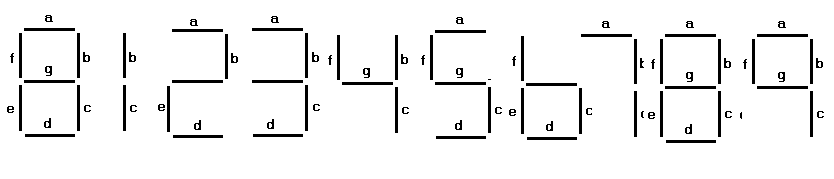

  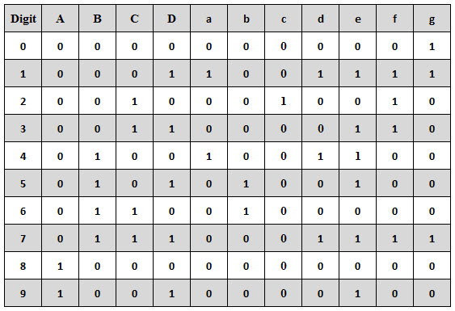

$a = F1 (A, B, C, D) = ∑m (0, 2, 3, 5, 7, 8, 9)$

$b = F2 (A, B, C, D) = ∑m (0, 1, 2, 3, 4, 7, 8, 9)$

$c = F3 (A, B, C, D) = ∑m (0, 1, 3, 4, 5, 6, 7, 8, 9)$

$d = F4 (A, B, C, D) = ∑m (0, 2, 3, 5, 6, 8)$

$e = F5 (A, B, C, D) = ∑m (0, 2, 6, 8)$

$f = F6 (A, B, C, D) = ∑m (0, 4, 5, 6, 8, 9)$

$g = F7 (A, B, C, D) = ∑m (2, 3, 4, 5, 6, 8, 9)$

  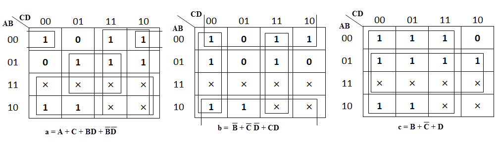

  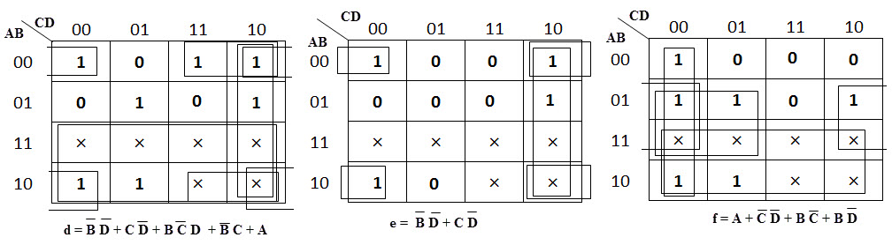

  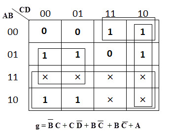

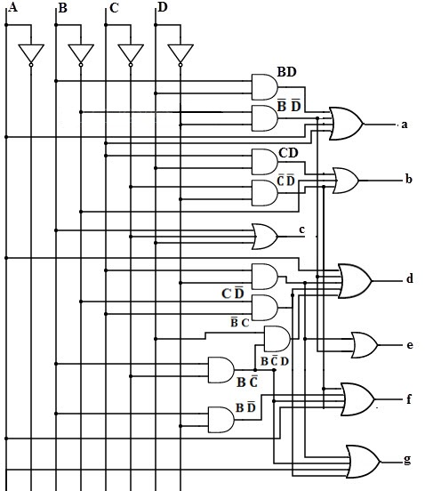


```python
def BCD_7segment9(p,q,r,s):
    a=OR(OR(p,r),OR(AND(q,s),AND(NOT(q),NOT(s))))
    b=OR(OR(NOT(q),AND(r,s)),AND(NOT(r),NOT(s)))
    c=OR(OR(q,NOT(r)),s)
    d=OR(OR(AND(NOT(q),NOT(s)),AND(r,NOT(s))),OR(OR(p,AND(NOT(q),r)),AND(AND(q,NOT(r)),s)))
    e=OR(AND(NOT(q),NOT(s)),AND(r,NOT(s)))
    f=OR(OR(p,AND(NOT(r),NOT(s))),OR(AND(q,NOT(r)),AND(q,NOT(s))))
    g=OR(OR(p,AND(q,NOT(r))),OR(AND(NOT(q),r),AND(r,NOT(s))))
    return a,b,c,d,e,f,g
```


```python
print('Input','\t|\t','Output')
print('A','B','C','D','|','a','b','c','d','e','f','g')
for w,x,y,z in zip(P1,Q1,R1,S1):
    a,b,c,d,e,f,g=BCD_7segment9(w,x,y,z)
    print(w,x,y,z,'|',a,b,c,d,e,f,g)
```

    Input 	|	 Output
    A B C D | a b c d e f g
    0 0 0 0 | 1 1 1 1 1 1 0
    0 0 0 1 | 0 1 1 0 0 0 0
    0 0 1 0 | 1 1 0 1 1 0 1
    0 0 1 1 | 1 1 1 1 0 0 1
    0 1 0 0 | 0 1 1 0 0 1 1
    0 1 0 1 | 1 0 1 1 0 1 1
    0 1 1 0 | 1 0 1 1 1 1 1
    0 1 1 1 | 1 1 1 0 0 0 0
    1 0 0 0 | 1 1 1 1 1 1 1
    1 0 0 1 | 1 1 1 1 0 1 1
    1 0 1 0 | 1 1 0 1 1 1 1
    1 0 1 1 | 1 1 1 1 0 1 1
    1 1 0 0 | 1 1 1 1 0 1 1
    1 1 0 1 | 1 0 1 1 0 1 1
    1 1 1 0 | 1 0 1 1 1 1 1
    1 1 1 1 | 1 1 1 1 0 1 1
    

# 7 segment display plot
 


```python
def display_7_segment(a,b,c,d,e,f,g):
    if a==1:
        a = "1"
        a = a.replace("1", "_" )
    elif a==0:
        a = "0"
        a = a.replace("0", " ")
    if b==1:
        b = "1"
        b = b.replace("1", "|" )
    elif b==0:
        b = "0"
        b = b.replace("0", " ")
    if c==1:
        c = "1"
        c = c.replace("1", "|" )
    elif c==0:
        c = "0"
        c = c.replace("0", " ")
    if d==1:
        d = "1"
        d = d.replace("1", "_" )
    elif d==0:
        d = "0"
        d = d.replace("0", " ")
    if e==1:
        e = "1"
        e = e.replace("1", "|" )
    elif e==0:
        e = "0"
        e = e.replace("0", " ")
    if f==1:
        f = "1"
        f = f.replace("1", "|" )
    elif f==0:
        f = "0"
        f = f.replace("0", " ")
    if g==1:
        g = "1"
        g = g.replace("1", "_" )
    elif g==0:
        g = "0"
        g = g.replace("0", " ")
        
    print('\033[1;31;48m'+'\t\t\t\t\t  ',a,"\n\t\t\t\t\t",f,g,b,"\n\t\t\t\t\t",e,d,c+'\033[0m')
    return '     '

print(display_7_segment(1,1,1,1,1,1,1))
```

    					   _ 
    					 | _ | 
    					 | _ |
         
    

### Now checking for the outputs of *BCD_7segment9(A,B,C,D)*


```python
print('Input','\t |\t','Output')
print(' A','B','C','D','|','a','b','c','d','e','f','g','|','Display in 7 segment')
for w,x,y,z in zip(P1[:10],Q1[:10],R1[:10],S1[:10]):
    a,b,c,d,e,f,g=BCD_7segment9(w,x,y,z)
    print('_______________________________________________')
    print('',w,x,y,z,'|',a,b,c,d,e,f,g,'|')
    print(display_7_segment(a,b,c,d,e,f,g))
print('_______________________________________________')
```

    Input 	 |	 Output
     A B C D | a b c d e f g | Display in 7 segment
    _______________________________________________
     0 0 0 0 | 1 1 1 1 1 1 0 |
    					   _ 
    					 |   | 
    					 | _ |
         
    _______________________________________________
     0 0 0 1 | 0 1 1 0 0 0 0 |
    					     
    					     | 
    					     |
         
    _______________________________________________
     0 0 1 0 | 1 1 0 1 1 0 1 |
    					   _ 
    					   _ | 
    					 | _  
         
    _______________________________________________
     0 0 1 1 | 1 1 1 1 0 0 1 |
    					   _ 
    					   _ | 
    					   _ |
         
    _______________________________________________
     0 1 0 0 | 0 1 1 0 0 1 1 |
    					     
    					 | _ | 
    					     |
         
    _______________________________________________
     0 1 0 1 | 1 0 1 1 0 1 1 |
    					   _ 
    					 | _   
    					   _ |
         
    _______________________________________________
     0 1 1 0 | 1 0 1 1 1 1 1 |
    					   _ 
    					 | _   
    					 | _ |
         
    _______________________________________________
     0 1 1 1 | 1 1 1 0 0 0 0 |
    					   _ 
    					     | 
    					     |
         
    _______________________________________________
     1 0 0 0 | 1 1 1 1 1 1 1 |
    					   _ 
    					 | _ | 
    					 | _ |
         
    _______________________________________________
     1 0 0 1 | 1 1 1 1 0 1 1 |
    					   _ 
    					 | _ | 
    					   _ |
         
    _______________________________________________
    

# $$\text{Binary-Coded-HexaDecimal  to 7 Segment LED Display Decoder}$$


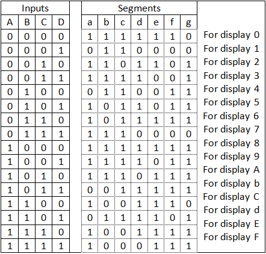


**K-map implementation**
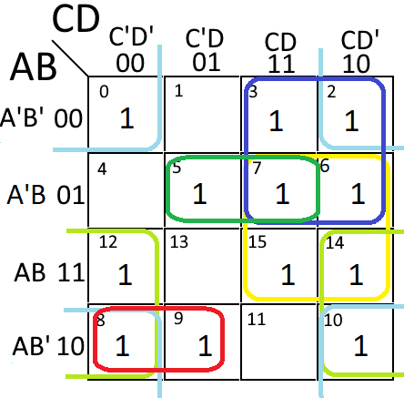

$a(A,B,C,D)=\sum (0,2,3,5,6,7,8,9,10,12,14,15)$

$a=AB'C'+A'BD+AD'+A'C+BC+B'D'$

  

$b(A,B,C,D)=\sum (0,1,2,3,4,7,8,9,10,13)$

$b=A'C'D'+A'CD+AC'D+B'C'+B'D'$

  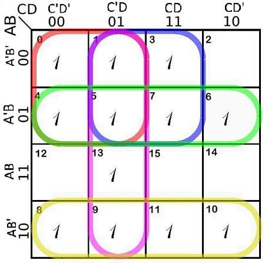

  $c(A,B,C,D)=\sum (0,1,3,4,5,6,7,8,9,10,11,13)$

$c=A'C'+A'D+C'D+A'B+AB'$

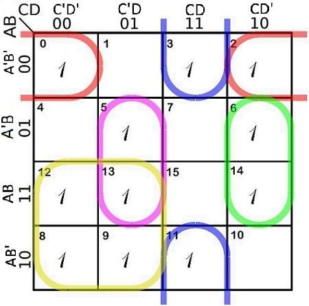
 
 $d(A,B,C,D)=\sum (0,2,3,5,6,7,8,9,11,12,13,14)$

$d=A'B'D'+B'CD+BC'D+BCD'+AC'$

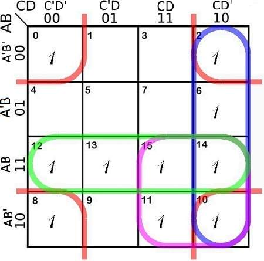
 
 $e(A,B,C,D)=\sum (0,2,6,8,10,11,12,13,14,15)$

$e=B'D'+CD'+AC+AB$

 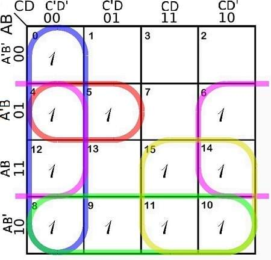
  
  $f(A,B,C,D)=\sum (0,4,5,6,8,9,10,11,12,14,15)$

$f=A'BC'+C'D'+BD'+AB'+AC$

  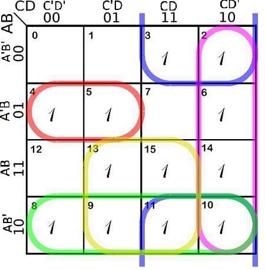

$g(A,B,C,D)=\sum (2,3,4,5,6,8,9,10,11,13,14,15)$

$g=A'BC'+B'C+CD'+AB'+AD$

$\text{So the required circuit diagram is :-}$

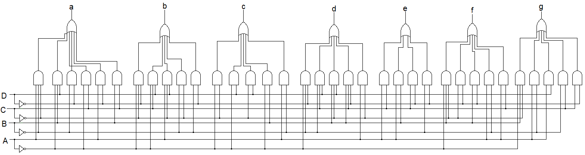


```python
def BChexD_7segment(p,q,r,s):
    A,B,C,D=p,q,r,s
    # N
    nA=NOT(A)  # A'
    nB=NOT(B)  # B'                      
    nC=NOT(C)  # C'
    nD=NOT(D)  # D'
    
    a= OR(OR(OR(OR(AND(nA,AND(B,D)),AND(A,AND(nB,nC))),OR(AND(nA,C),AND(B,C))),AND(nB,nD)),AND(A,nD))
    b= OR(OR(OR(OR(AND(nA,AND(nC,nD)),AND(nA,AND(C,D))),AND(A,AND(nC,D))),AND(nB,nC)),AND(nB,nD))
    c= OR(OR(OR(OR(AND(nA,nC),AND(nA,D)),AND(nC,D)),AND(nA,B)),AND(A,nB))
    d= OR(OR(OR(OR(AND(nA,AND(nB,nD)),AND(nB,AND(C,D))),AND(B,AND(nC,D))),AND(B,AND(C,nD))),AND(A,nC))
    e= OR(OR(OR(AND(nB,nD),AND(C,nD)),AND(A,C)),AND(A,B))
    f= OR(OR(OR(OR(AND(nA,AND(B,nC)),AND(nC,nD)),AND(B,nD)),AND(A,nB)),AND(A,C))
    g= OR(OR(OR(OR(AND(nA,AND(B,nC)),AND(nB,C)),AND(C,nD)),AND(A,nB)),AND(A,D))
    return a,b,c,d,e,f,g
```


```python
print('Input','\t |\t','Output')
print(' A','B','C','D','|','a','b','c','d','e','f','g','|','Display in 7 segment')
for w,x,y,z in zip(P1,Q1,R1,S1):
    a,b,c,d,e,f,g=BChexD_7segment(w,x,y,z)
    print('_______________________________________________')
    print('',w,x,y,z,'|',a,b,c,d,e,f,g,'|')
    print(display_7_segment(a,b,c,d,e,f,g))
print('_______________________________________________')
```

    Input 	 |	 Output
     A B C D | a b c d e f g | Display in 7 segment
    _______________________________________________
     0 0 0 0 | 1 1 1 1 1 1 0 |
    					   _ 
    					 |   | 
    					 | _ |
         
    _______________________________________________
     0 0 0 1 | 0 1 1 0 0 0 0 |
    					     
    					     | 
    					     |
         
    _______________________________________________
     0 0 1 0 | 1 1 0 1 1 0 1 |
    					   _ 
    					   _ | 
    					 | _  
         
    _______________________________________________
     0 0 1 1 | 1 1 1 1 0 0 1 |
    					   _ 
    					   _ | 
    					   _ |
         
    _______________________________________________
     0 1 0 0 | 0 1 1 0 0 1 1 |
    					     
    					 | _ | 
    					     |
         
    _______________________________________________
     0 1 0 1 | 1 0 1 1 0 1 1 |
    					   _ 
    					 | _   
    					   _ |
         
    _______________________________________________
     0 1 1 0 | 1 0 1 1 1 1 1 |
    					   _ 
    					 | _   
    					 | _ |
         
    _______________________________________________
     0 1 1 1 | 1 1 1 0 0 0 0 |
    					   _ 
    					     | 
    					     |
         
    _______________________________________________
     1 0 0 0 | 1 1 1 1 1 1 1 |
    					   _ 
    					 | _ | 
    					 | _ |
         
    _______________________________________________
     1 0 0 1 | 1 1 1 1 0 1 1 |
    					   _ 
    					 | _ | 
    					   _ |
         
    _______________________________________________
     1 0 1 0 | 1 1 1 0 1 1 1 |
    					   _ 
    					 | _ | 
    					 |   |
         
    _______________________________________________
     1 0 1 1 | 0 0 1 1 1 1 1 |
    					     
    					 | _   
    					 | _ |
         
    _______________________________________________
     1 1 0 0 | 1 0 0 1 1 1 0 |
    					   _ 
    					 |     
    					 | _  
         
    _______________________________________________
     1 1 0 1 | 0 1 1 1 1 0 1 |
    					     
    					   _ | 
    					 | _ |
         
    _______________________________________________
     1 1 1 0 | 1 0 0 1 1 1 1 |
    					   _ 
    					 | _   
    					 | _  
         
    _______________________________________________
     1 1 1 1 | 1 0 0 0 1 1 1 |
    					   _ 
    					 | _   
    					 |    
         
    _______________________________________________
    

 


```python
def BCD_excess3_converter(a,b,c,d):
    N1=NOT(b)
    N2=NOT(d)          # z
    A1=AND(c,d)        
    O1=OR(c,d)
    N3=NOT(O1)
    O2=OR(A1,N3)      # y
    A2=AND(N3,b)
    A3=AND(O1,N1)
    A4=AND(O1,b)
    O3=OR(A2,A3)      # x
    O4=OR(A4,a)       # w
    return O4,O3,O2,N2
```


```python
print('Input','\t |\t','Output')
print(' A','B','C','D','|','W','X','Y','Z','|','a','b','c','d','e','f','g','|','Display in 7 segment')
for a1,b1,c1,d1 in zip(P1,Q1,R1,S1):
    w,x,y,z=BCD_excess3_converter(a1,b1,c1,d1)
    a,b,c,d,e,f,g=BChexD_7segment(w,x,y,z)
    print('_________________________________________________________')
    print('',a1,b1,c1,d1,'|',w,x,y,z,'|',a,b,c,d,e,f,g,'|\t')
    print(display_7_segment(a,b,c,d,e,f,g))
print('_________________________________________________________')
```

    Input 	 |	 Output
     A B C D | W X Y Z | a b c d e f g | Display in 7 segment
    _________________________________________________________
     0 0 0 0 | 0 0 1 1 | 1 1 1 1 0 0 1 |	
    					   _ 
    					   _ | 
    					   _ |
         
    _________________________________________________________
     0 0 0 1 | 0 1 0 0 | 0 1 1 0 0 1 1 |	
    					     
    					 | _ | 
    					     |
         
    _________________________________________________________
     0 0 1 0 | 0 1 0 1 | 1 0 1 1 0 1 1 |	
    					   _ 
    					 | _   
    					   _ |
         
    _________________________________________________________
     0 0 1 1 | 0 1 1 0 | 1 0 1 1 1 1 1 |	
    					   _ 
    					 | _   
    					 | _ |
         
    _________________________________________________________
     0 1 0 0 | 0 1 1 1 | 1 1 1 0 0 0 0 |	
    					   _ 
    					     | 
    					     |
         
    _________________________________________________________
     0 1 0 1 | 1 0 0 0 | 1 1 1 1 1 1 1 |	
    					   _ 
    					 | _ | 
    					 | _ |
         
    _________________________________________________________
     0 1 1 0 | 1 0 0 1 | 1 1 1 1 0 1 1 |	
    					   _ 
    					 | _ | 
    					   _ |
         
    _________________________________________________________
     0 1 1 1 | 1 0 1 0 | 1 1 1 0 1 1 1 |	
    					   _ 
    					 | _ | 
    					 |   |
         
    _________________________________________________________
     1 0 0 0 | 1 0 1 1 | 0 0 1 1 1 1 1 |	
    					     
    					 | _   
    					 | _ |
         
    _________________________________________________________
     1 0 0 1 | 1 1 0 0 | 1 0 0 1 1 1 0 |	
    					   _ 
    					 |     
    					 | _  
         
    _________________________________________________________
     1 0 1 0 | 1 1 0 1 | 0 1 1 1 1 0 1 |	
    					     
    					   _ | 
    					 | _ |
         
    _________________________________________________________
     1 0 1 1 | 1 1 1 0 | 1 0 0 1 1 1 1 |	
    					   _ 
    					 | _   
    					 | _  
         
    _________________________________________________________
     1 1 0 0 | 1 1 1 1 | 1 0 0 0 1 1 1 |	
    					   _ 
    					 | _   
    					 |    
         
    _________________________________________________________
     1 1 0 1 | 1 0 0 0 | 1 1 1 1 1 1 1 |	
    					   _ 
    					 | _ | 
    					 | _ |
         
    _________________________________________________________
     1 1 1 0 | 1 0 0 1 | 1 1 1 1 0 1 1 |	
    					   _ 
    					 | _ | 
    					   _ |
         
    _________________________________________________________
     1 1 1 1 | 1 0 1 0 | 1 1 1 0 1 1 1 |	
    					   _ 
    					 | _ | 
    					 |   |
         
    _________________________________________________________
    

# $$\text{Implementation of a full-adder with a decoder}$$
    
  


```python
def decoder_fullAdder(D0,D1,D2,D3,D4,D5,D6,D7):
    #OR
    S=OR(OR(D1,D2),OR(D4,D7))
    C=OR(OR(D3,D5),OR(D6,D7))
    return S,C
```


```python
print('\tInput','\t\t\t|','Output')
print('x','y','z','|','D\u2080','D\u2081','D\u2082','D\u2083','D\u2084','D\u2085','D\u2086','D\u2087','|','S','C')
for x,y,z in zip(X1,Y1,Z1):
    D0,D1,D2,D3,D4,D5,D6,D7=decoder3_8(x,y,z)
    S,C=decoder_fullAdder(D0,D1,D2,D3,D4,D5,D6,D7)
    print(x,y,z,'|',D0,'',D1,'',D2,'',D3,'',D4,'',D5,'',D6,'',D7,' |',S,C)
```

    	Input 			| Output
    x y z | D₀ D₁ D₂ D₃ D₄ D₅ D₆ D₇ | S C
    0 0 0 | 1  0  0  0  0  0  0  0  | 0 0
    0 0 1 | 0  1  0  0  0  0  0  0  | 1 0
    0 1 0 | 0  0  1  0  0  0  0  0  | 1 0
    0 1 1 | 0  0  0  1  0  0  0  0  | 0 1
    1 0 0 | 0  0  0  0  1  0  0  0  | 1 0
    1 0 1 | 0  0  0  0  0  1  0  0  | 0 1
    1 1 0 | 0  0  0  0  0  0  1  0  | 0 1
    1 1 1 | 0  0  0  0  0  0  0  1  | 1 1
    

# $$\text{Octal-to-binary encoder}$$


```python
def Encoder_OctaltoBinary(D0,D1,D2,D3,D4,D5,D6,D7):
    #OR
    x=OR(OR(D4,D5),OR(D6,D7))
    y=OR(OR(D2,D3),OR(D6,D7))
    z=OR(OR(D1,D3),OR(D5,D7))
    return x,y,z
```


```python
print('\tInput','\t\t\t|','Output')
print('x','y','z','|','D\u2080','D\u2081','D\u2082','D\u2083','D\u2084','D\u2085','D\u2086','D\u2087','|','X','Y','Z')
for x,y,z in zip(X1,Y1,Z1):
    D0,D1,D2,D3,D4,D5,D6,D7=decoder3_8(x,y,z)
    x1,y1,z1=Encoder_OctaltoBinary(D0,D1,D2,D3,D4,D5,D6,D7)
    print(x,y,z,'|',D0,'',D1,'',D2,'',D3,'',D4,'',D5,'',D6,'',D7,' |',x1,y1,z1)
```

    	Input 			| Output
    x y z | D₀ D₁ D₂ D₃ D₄ D₅ D₆ D₇ | X Y Z
    0 0 0 | 1  0  0  0  0  0  0  0  | 0 0 0
    0 0 1 | 0  1  0  0  0  0  0  0  | 0 0 1
    0 1 0 | 0  0  1  0  0  0  0  0  | 0 1 0
    0 1 1 | 0  0  0  1  0  0  0  0  | 0 1 1
    1 0 0 | 0  0  0  0  1  0  0  0  | 1 0 0
    1 0 1 | 0  0  0  0  0  1  0  0  | 1 0 1
    1 1 0 | 0  0  0  0  0  0  1  0  | 1 1 0
    1 1 1 | 0  0  0  0  0  0  0  1  | 1 1 1
    

# $$\text{2-to-4 line decoder with enable (E) input}$$


```python
def decoder2to4(a,b,E):
    #NOT
    n1=NOT(a)
    n2=NOT(b)
    n3=NOT(E)
    #NAND
    A1=NOT(AND(AND(n1,n2),n3)) #D₀
    A2=NOT(AND(AND(n1,b),n3))  #D₁
    A3=NOT(AND(AND(a,n2),n3))  #D₂
    A4=NOT(AND(AND(a,b),n3))   #D₃
    return A1,A2,A3,A4
```


```python
print('Input',' |','Output')
print(' E','A','B','|','D\u2080','D\u2081','D\u2082','D\u2083')
for E in [0,1]:
    for a,b in zip(A,B):
        D0,D1,D2,D3=decoder2to4(a,b,E)
        
        if E==1:
            print('\033[1;34;40m',E,a,b,'|',D0,'',D1,'',D2,'',D3,'\033[0m')
        else :
            print('',E,a,b,'|',D0,'',D1,'',D2,'',D3)
```

    Input  | Output
     E A B | D₀ D₁ D₂ D₃
     0 0 0 | 0  1  1  1
     0 0 1 | 1  0  1  1
     0 1 0 | 1  1  0  1
     0 1 1 | 1  1  1  0
     1 0 0 | 1  1  1  1 
     1 0 1 | 1  1  1  1 
     1 1 0 | 1  1  1  1 
     1 1 1 | 1  1  1  1 
    

# $$\text{4-to-1 line multiplexer}$$


```python
def multiplexer4to1(I0,I1,I2,I3,S0,S1):
    #NOT
    n1=NOT(S0)
    n2=NOT(S1)
    #AND
    A1=AND(AND(n1,n2),I0)
    A2=AND(AND(S0,n2),I1)
    A3=AND(AND(n1,S1),I2)
    A4=AND(AND(S0,S1),I3)
    #OR
    Y=OR(OR(A1,A2),OR(A3,A4))
    
    if (I0==1)&(Y==1): 
        s='I\u2080'
    elif (I1==1)&(Y==1): 
        s='I\u2081'
    elif (I2==1)&(Y==1): 
        s='I\u2082'
    elif (I3==1)&(Y==1): 
        s='I\u2083'
    else: 
        s=''
    return Y,s
```


```python
print('\tInput','\t   |','Output')
print(' I\u2080','I\u2081','I\u2082','I\u2083','S\u2080','S\u2081','|','Y')
for I0,I1,I2,I3 in zip(P1,Q1,R1,S1):
    for S0,S1 in zip(A,B):
        Y,s= multiplexer4to1(I0,I1,I2,I3,S0,S1)
            
        if Y==1:
            print('\033[1;34;43m',+I0,'',I1,'',I2,'',I3,'',S0,'',S1,' |',Y,s+'\033[0m')
        else :
            print('',I0,'',I1,'',I2,'',I3,'',S0,'',S1,' |',Y,s)
```

    	Input 	   | Output
     I₀ I₁ I₂ I₃ S₀ S₁ | Y
     0  0  0  0  0  0  | 0 
     0  0  0  0  0  1  | 0 
     0  0  0  0  1  0  | 0 
     0  0  0  0  1  1  | 0 
     0  0  0  1  0  0  | 0 
     0  0  0  1  0  1  | 0 
     0  0  0  1  1  0  | 0 
     0  0  0  1  1  1  | 1 I₃
     0  0  1  0  0  0  | 0 
     0  0  1  0  0  1  | 1 I₂
     0  0  1  0  1  0  | 0 
     0  0  1  0  1  1  | 0 
     0  0  1  1  0  0  | 0 
     0  0  1  1  0  1  | 1 I₂
     0  0  1  1  1  0  | 0 
     0  0  1  1  1  1  | 1 I₂
     0  1  0  0  0  0  | 0 
     0  1  0  0  0  1  | 0 
     0  1  0  0  1  0  | 1 I₁
     0  1  0  0  1  1  | 0 
     0  1  0  1  0  0  | 0 
     0  1  0  1  0  1  | 0 
     0  1  0  1  1  0  | 1 I₁
     0  1  0  1  1  1  | 1 I₁
     0  1  1  0  0  0  | 0 
     0  1  1  0  0  1  | 1 I₁
     0  1  1  0  1  0  | 1 I₁
     0  1  1  0  1  1  | 0 
     0  1  1  1  0  0  | 0 
     0  1  1  1  0  1  | 1 I₁
     0  1  1  1  1  0  | 1 I₁
     0  1  1  1  1  1  | 1 I₁
     1  0  0  0  0  0  | 1 I₀
     1  0  0  0  0  1  | 0 
     1  0  0  0  1  0  | 0 
     1  0  0  0  1  1  | 0 
     1  0  0  1  0  0  | 1 I₀
     1  0  0  1  0  1  | 0 
     1  0  0  1  1  0  | 0 
     1  0  0  1  1  1  | 1 I₀
     1  0  1  0  0  0  | 1 I₀
     1  0  1  0  0  1  | 1 I₀
     1  0  1  0  1  0  | 0 
     1  0  1  0  1  1  | 0 
     1  0  1  1  0  0  | 1 I₀
     1  0  1  1  0  1  | 1 I₀
     1  0  1  1  1  0  | 0 
     1  0  1  1  1  1  | 1 I₀
     1  1  0  0  0  0  | 1 I₀
     1  1  0  0  0  1  | 0 
     1  1  0  0  1  0  | 1 I₀
     1  1  0  0  1  1  | 0 
     1  1  0  1  0  0  | 1 I₀
     1  1  0  1  0  1  | 0 
     1  1  0  1  1  0  | 1 I₀
     1  1  0  1  1  1  | 1 I₀
     1  1  1  0  0  0  | 1 I₀
     1  1  1  0  0  1  | 1 I₀
     1  1  1  0  1  0  | 1 I₀
     1  1  1  0  1  1  | 0 
     1  1  1  1  0  0  | 1 I₀
     1  1  1  1  0  1  | 1 I₀
     1  1  1  1  1  0  | 1 I₀
     1  1  1  1  1  1  | 1 I₀
    


```python
I=([1,0,0,0],
   [0,1,0,0],
   [0,0,1,0],
   [0,0,0,1])

print('\tInput','\t   |','Output')
print('I\u2080','I\u2081','I\u2082','I\u2083','S\u2080','S\u2081',' |','Y')

for I0,I1,I2,I3 in (I):
    for S0,S1 in zip(A,B):
        Y,s= multiplexer4to1(I0,I1,I2,I3,S0,S1)
            
        if Y==1:
            print('\033[1;34;43m',+I0,'',I1,'',I2,'',I3,'',S0,'',S1,' |',Y,s+'\033[0m')
        else :
            print('',I0,'',I1,'',I2,'',I3,'',S0,'',S1,' |',Y,s)
```

    	Input 	   | Output
    I₀ I₁ I₂ I₃ S₀ S₁  | Y
     1  0  0  0  0  0  | 1 I₀
     1  0  0  0  0  1  | 0 
     1  0  0  0  1  0  | 0 
     1  0  0  0  1  1  | 0 
     0  1  0  0  0  0  | 0 
     0  1  0  0  0  1  | 0 
     0  1  0  0  1  0  | 1 I₁
     0  1  0  0  1  1  | 0 
     0  0  1  0  0  0  | 0 
     0  0  1  0  0  1  | 1 I₂
     0  0  1  0  1  0  | 0 
     0  0  1  0  1  1  | 0 
     0  0  0  1  0  0  | 0 
     0  0  0  1  0  1  | 0 
     0  0  0  1  1  0  | 0 
     0  0  0  1  1  1  | 1 I₃
    

# $$\text{8-to-1 line multiplexer}$$

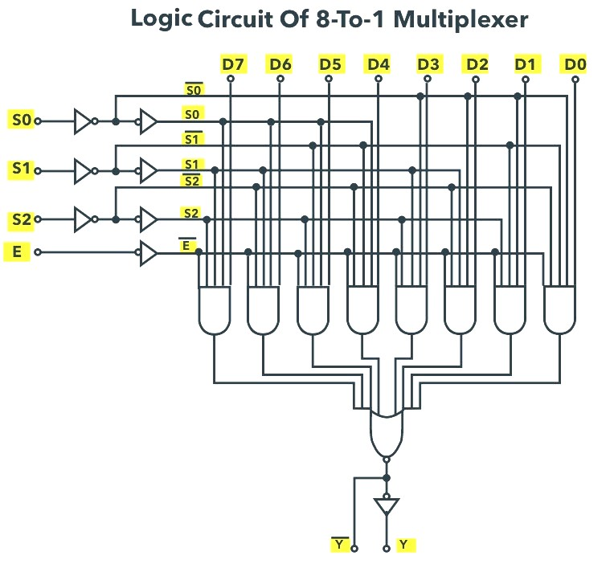


```python
def multiplexer8to1(D0,D1,D2,D3,D4,D5,D6,D7,S0,S1,S2,E):
    #NOT
    n0=NOT(S0)
    n1=NOT(S1)
    n2=NOT(S2)
    E1=NOT(E)
    #AND
    dS0S1=AND(n0,n1)        
    S0dS1=AND(S0,n1)        
    S1dS0=AND(n0,S1)        
    S0S1=AND(S0,S1)     
    
    A0=AND(AND(AND(dS0S1,n2),D0),E1)    # S0'S1'S2'D0E'
    A1=AND(AND(AND(dS0S1,S2),D1),E1)    # S0'S1'S2D1E'
    A2=AND(AND(AND(S1dS0,n2),D2),E1)    # S0'S1S2'D2E
    A3=AND(AND(AND(S1dS0,S2),D3),E1)    # S0'S1S2D3E'
    A4=AND(AND(AND(S0dS1,n2),D4),E1)    # S0S1'S2'D4E'
    A5=AND(AND(AND(S0dS1,S2),D5),E1)    # S0S1'S2D5E'
    A6=AND(AND(AND(S0S1,n2),D6),E1)     # S0S1S2'D6E'
    A7=AND(AND(AND(S0S1,S2),D7),E1)     # S0S1S2D7E'

    #OR
    bY=NOT(OR(OR(OR(A0,A1),OR(A2,A3)),OR(OR(A4,A5),OR(A6,A7))))
    Y=NOT(bY)
    
    
    if (D0==1)&(Y==1): 
        s='D\u2080'
    elif (D1==1)&(Y==1): 
        s='D\u2081'
    elif (D2==1)&(Y==1): 
        s='D\u2082'
    elif (D3==1)&(Y==1): 
        s='D\u2083'
    elif (D4==1)&(Y==1): 
        s='D\u2084'
    elif (D5==1)&(Y==1): 
        s='D\u2085'
    elif (D6==1)&(Y==1): 
        s='D\u2086'
    elif (D7==1)&(Y==1): 
        s='D\u2087'
    else: 
        s=''
    return Y,bY,s
```


```python
print('\tInput','\t\t\t\t| Output')
print('E','S₀','S₁','S₂','|','D₀','D₁','D₂','D₃','D₄','D₅','D₆','D₇','\t|','Y')

for S0,S1,S2 in zip(X1,Y1,Z1):
    for E in [1,0]:
        if E==1: 
            D0,D1,D2,D3,D4,D5,D6,D7=0,0,0,0,0,0,0,0
            Y,bY,s=multiplexer8to1(D0,D1,D2,D3,D4,D5,D6,D7,S0,S1,S2,E)
        else:
            D0,D1,D2,D3,D4,D5,D6,D7=decoder3_8(S0,S1,S2)
            Y,bY,s=multiplexer8to1(D0,D1,D2,D3,D4,D5,D6,D7,S0,S1,S2,E)
        print(E,S0,'',S1,'',S2,' |',D0,'',D1,'',D2,'',D3,'',D4,'',D5,'',D6,'',D7,'\t|',Y,s)
```

    	Input 				| Output
    E S₀ S₁ S₂ | D₀ D₁ D₂ D₃ D₄ D₅ D₆ D₇ 	| Y
    1 0  0  0  | 0  0  0  0  0  0  0  0 	| 0 
    0 0  0  0  | 1  0  0  0  0  0  0  0 	| 1 D₀
    1 0  0  1  | 0  0  0  0  0  0  0  0 	| 0 
    0 0  0  1  | 0  1  0  0  0  0  0  0 	| 1 D₁
    1 0  1  0  | 0  0  0  0  0  0  0  0 	| 0 
    0 0  1  0  | 0  0  1  0  0  0  0  0 	| 1 D₂
    1 0  1  1  | 0  0  0  0  0  0  0  0 	| 0 
    0 0  1  1  | 0  0  0  1  0  0  0  0 	| 1 D₃
    1 1  0  0  | 0  0  0  0  0  0  0  0 	| 0 
    0 1  0  0  | 0  0  0  0  1  0  0  0 	| 1 D₄
    1 1  0  1  | 0  0  0  0  0  0  0  0 	| 0 
    0 1  0  1  | 0  0  0  0  0  1  0  0 	| 1 D₅
    1 1  1  0  | 0  0  0  0  0  0  0  0 	| 0 
    0 1  1  0  | 0  0  0  0  0  0  1  0 	| 1 D₆
    1 1  1  1  | 0  0  0  0  0  0  0  0 	| 0 
    0 1  1  1  | 0  0  0  0  0  0  0  1 	| 1 D₇
    


```python

```
